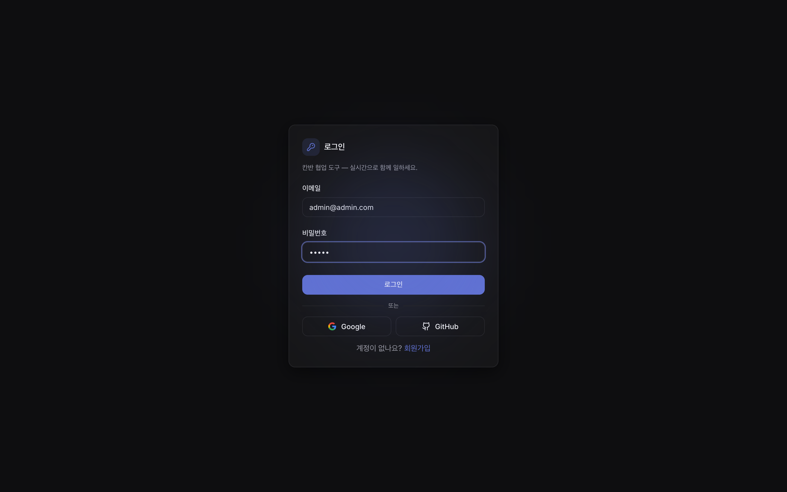
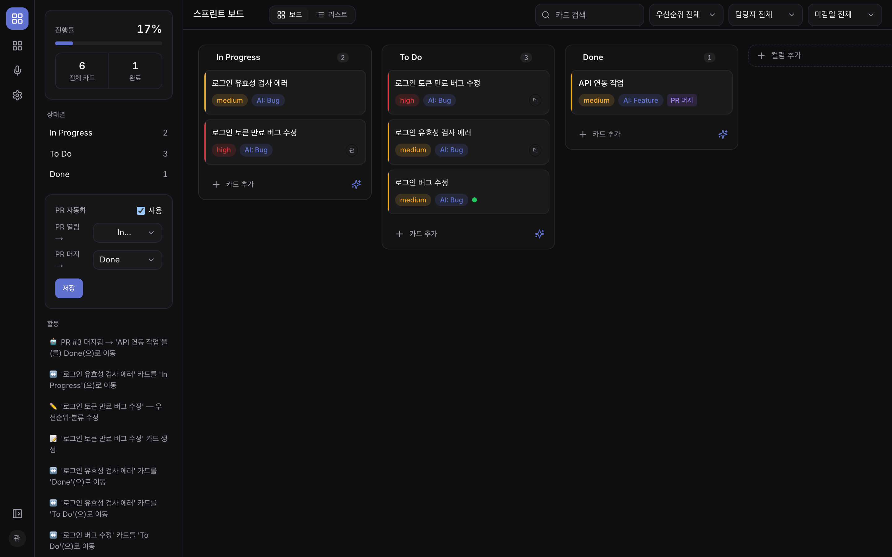
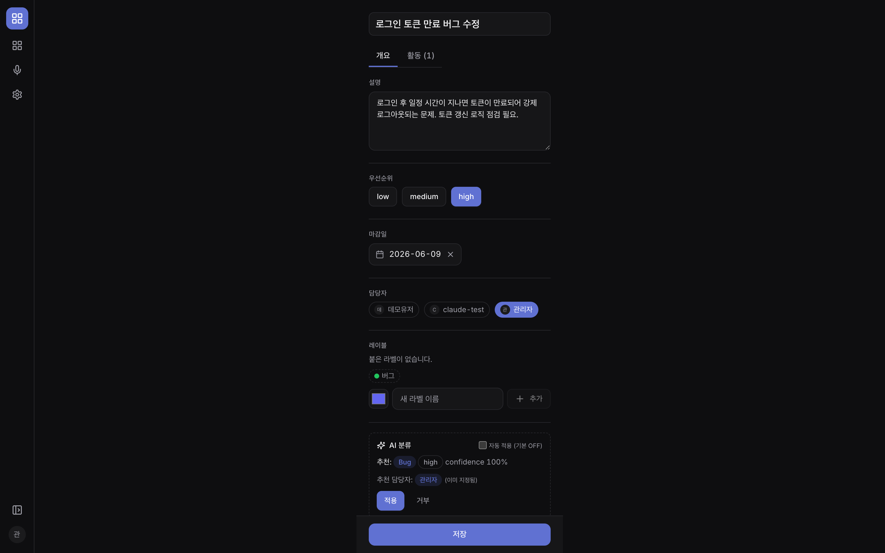
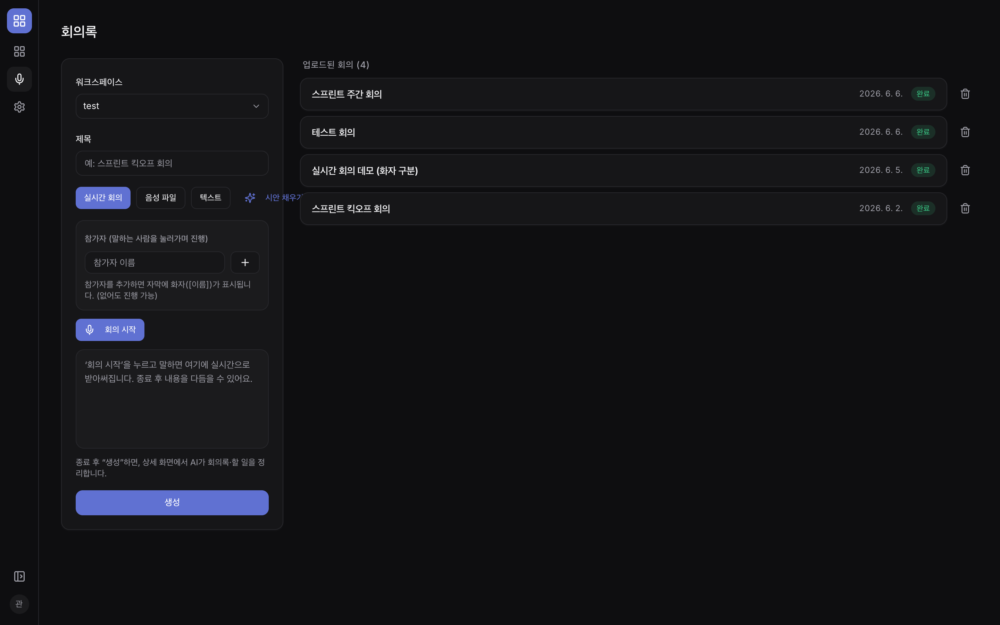
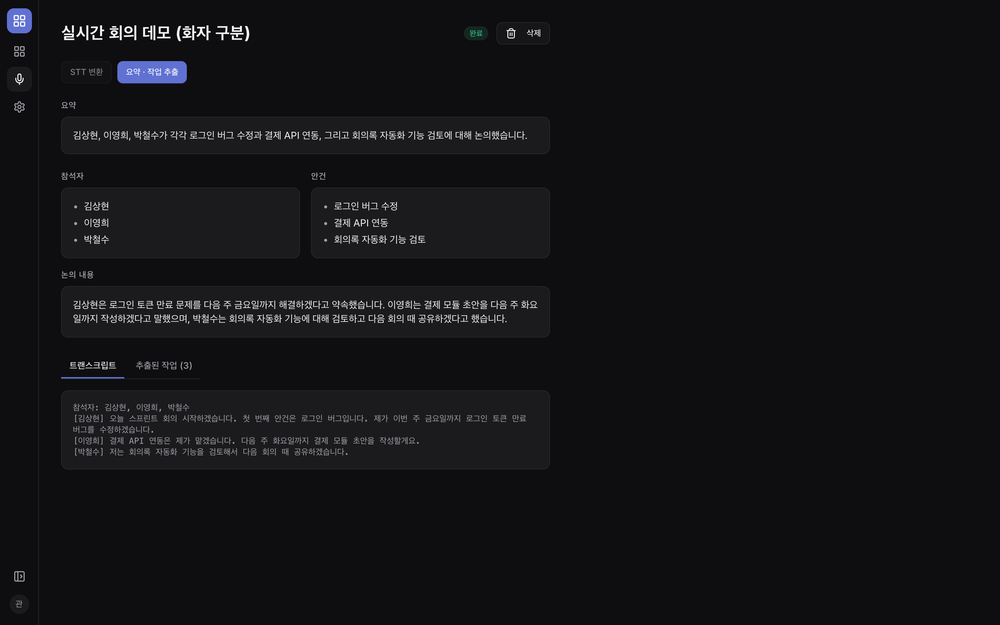
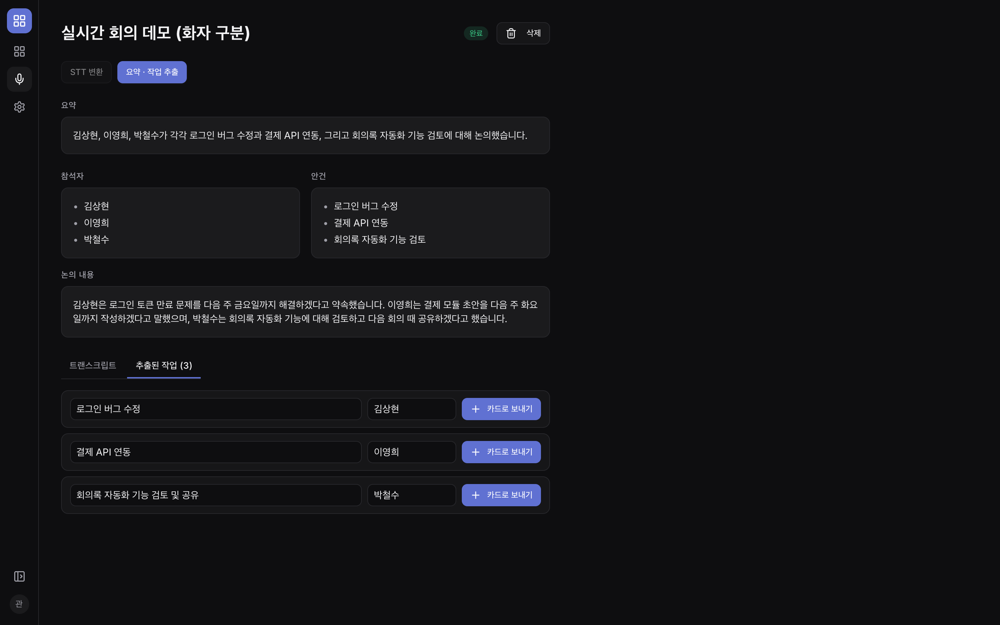
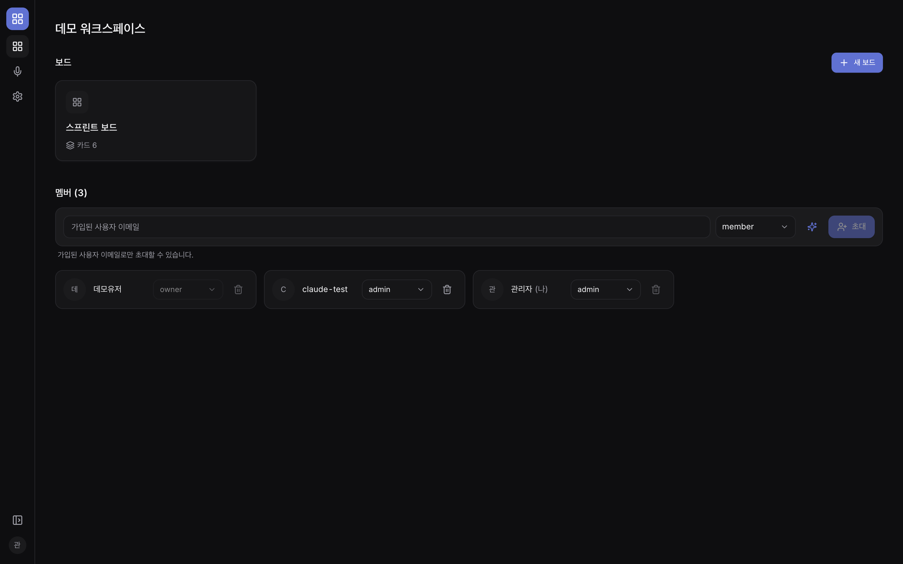

# 시연 시나리오

- **GitHub 저장소**: [github.com/sanghyeonKim0201/kanban-collab](https://github.com/sanghyeonKim0201/kanban-collab)
- **데모 계정**: `admin@admin.com` / `admin`
- **실행**: `npm run dev` → `http://localhost:3000`
- **순서**: 로그인 → 보드 → AI 추천 → 실시간 → GitHub → AI 회의록 → 멤버 관리

---

## 1. 시연 순서

| # | 무엇을 | 입력 | 결과 |
|---|---|---|---|
| 0 | 로그인 | `admin@admin.com` / `admin` | 워크스페이스 목록이 나온다 |
| 1 | 보드 열기 | "데모 워크스페이스" → "스프린트 보드" | 칸 3개와 카드가 보인다 |
| 2 | 카드 추가·드래그 | 자동입력(✨) 후 추가, 카드 드래그 | 카드가 생기고 옮겨진다 |
| 3 | AI 추천 | 카드 상세 → "AI 추천 받기" | 카테고리·우선순위·담당자를 추천한다 |
| 4 | 카드 상세 | 레이블·댓글 | 저장되고, 댓글은 본인만 수정 가능 |
| 5 | 실시간 협업 | 창 2개(시크릿창)로 카드 이동 | 다른 창에 바로 반영, 상대 커서 표시 |
| 6 | GitHub | PR 머지 | 카드가 Done으로 자동 이동 + `🤖` 기록 |
| 7 | AI 회의록 | 실시간 회의(✨/음성) → 생성 | 요약·할 일 3개 → "카드로 보내기" |
| 8 | 멤버 관리 | 초대·역할 변경 | 반영되고, 잘못 입력하면 안내 메시지 |

---

## 2. 시연 화면

### 로그인

### 칸반 보드

### AI 추천 (실제 AI 응답: Bug · high · 확신도 100%)

### AI 회의록

### 멤버 관리

> 위 화면은 전부 실제로 돌려서 찍었다.

---

## 3. 발표 전 점검

- [ ] `.env.local`에 Supabase·AI 키 들어있는지 확인
- [ ] `npm run dev` 잘 켜지는지, `localhost:3000` 접속되는지
- [ ] 데모 계정 로그인 되는지
- [ ] "데모 워크스페이스 / 스프린트 보드"에 카드 보이는지
- [ ] 실시간용 두 번째 창(시크릿창) 준비
